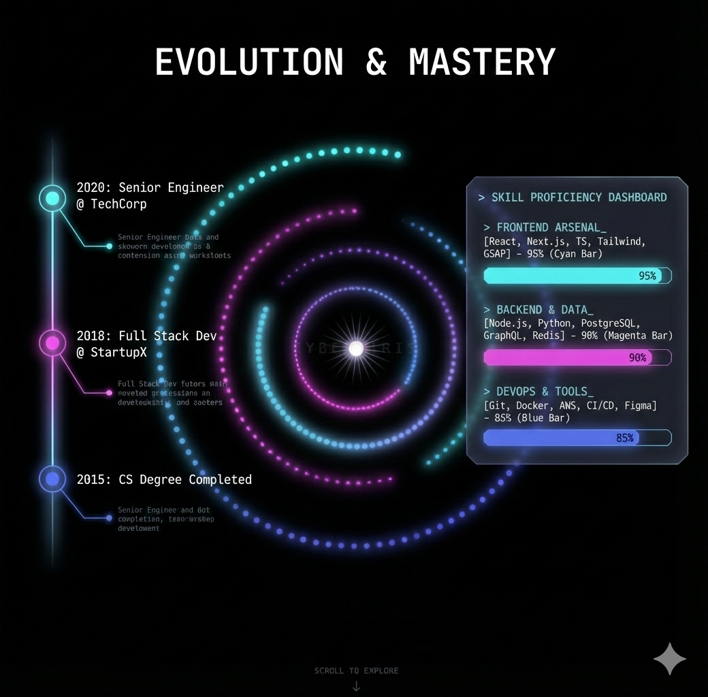

# Stage 1 - Profile Overlay 實作文件

## 設計概述

Stage 1 顯示個人資訊覆蓋層，包含兩大區塊：
- **左側**：經歷時間軸 (Timeline)
- **右側**：技能儀表板 (Skill Dashboard)

中央保持 CyberIris 粒子動畫（Bloom 效果）作為視覺焦點。



---

## 視覺分析

### 標題區
- 文字：`EVOLUTION & MASTERY`
- 樣式：大字、置中、白色、字距加寬
- 位置：頂部 padding

### 左側 - 經歷時間軸

```
Timeline Layout:
    ┌─────────────────────────────┐
    │   2020: Senior Engineer     │ ◄─ 節點 (發光 cyan 圓點)
    │   @ TechCorp                │
    │   Description text...       │
    │           │                 │
    │           │ ◄─ 連接線 (cyan, 漸層發光)
    │           │                 │
    │   2018: Full Stack Dev      │
    │   @ StartupX                │
    │   Description text...       │
    │           │                 │
    │   2015: CS Degree           │
    │   Completed                 │
    │   Description text...       │
    └─────────────────────────────┘
```

**特點：**
- 垂直時間軸，由上到下（最新 → 最舊）
- 每個節點有發光的 cyan 圓點
- 連接線為 cyan 漸層，帶光暈效果
- 一次只顯示 3 個項目
- 需要上/下箭頭導航更多項目

### 右側 - 技能儀表板

```
┌─────────────────────────────────────┐
│  > SKILL PROFICIENCY DASHBOARD      │ ◄─ 終端機風格標題
├─────────────────────────────────────┤
│                                     │
│  > FRONTEND ARSENAL_                │
│  [React, Next.js, TS, Tailwind,     │
│   GSAP] - 95%                       │
│  ████████████████████░░░░░  95%     │ ◄─ Cyan 進度條
│                                     │
│  > BACKEND & DATA_                  │
│  [Node.js, Python, PostgreSQL,      │
│   GraphQL, Redis] - 90%             │
│  ███████████████████░░░░░░  90%     │ ◄─ Magenta 進度條
│                                     │
│  > DEVOPS & TOOLS_                  │
│  [Git, Docker, AWS, CI/CD, Figma]   │
│  - 85%                              │
│  █████████████████░░░░░░░░  85%     │ ◄─ Blue 進度條
│                                     │
└─────────────────────────────────────┘
```

**特點：**
- 終端機/駭客風格的容器邊框
- 每個技能類別有獨特顏色
- 進度條帶漸層光暈
- 數字動態計數效果

---

## 組件架構

```
src/components/
├── stage1/
│   ├── Stage1Overlay.tsx      # Stage 1 主覆蓋層
│   ├── Timeline.tsx           # 時間軸容器
│   ├── TimelineItem.tsx       # 單個時間軸項目
│   ├── TimelineNav.tsx        # 時間軸導航箭頭
│   ├── SkillDashboard.tsx     # 技能儀表板容器
│   ├── SkillCategory.tsx      # 單個技能類別
│   └── ProgressBar.tsx        # 進度條組件
```

---

## 資料結構

### Timeline 資料

```typescript
interface TimelineEntry {
  id: string
  year: number
  title: string           // "Senior Engineer"
  organization: string    // "TechCorp"
  description: string
  type: 'work' | 'education' | 'achievement'
}

// 範例資料
const timelineData: TimelineEntry[] = [
  {
    id: 'exp-1',
    year: 2020,
    title: 'Senior Engineer',
    organization: 'TechCorp',
    description: 'Senior Engineer role and managed operations...',
    type: 'work'
  },
  // ... more entries
]
```

### Skill 資料

```typescript
interface SkillCategory {
  id: string
  name: string            // "FRONTEND ARSENAL"
  skills: string[]        // ["React", "Next.js", "TS", ...]
  proficiency: number     // 0-100
  color: 'cyan' | 'magenta' | 'blue'
}

// 範例資料
const skillData: SkillCategory[] = [
  {
    id: 'frontend',
    name: 'FRONTEND ARSENAL',
    skills: ['React', 'Next.js', 'TS', 'Tailwind', 'GSAP'],
    proficiency: 95,
    color: 'cyan'
  },
  // ... more categories
]
```

---

## 組件規格

### 1. Stage1Overlay

**責任：**
- Stage 1 的主容器
- 管理進場/退場動畫
- 根據 scrollProgress 控制透明度
- 佈局左/右兩側區塊

**Props:**
```typescript
interface Stage1OverlayProps {
  scrollProgress: number  // 0-3, Stage 1 在 1.0 時完全顯示
}
```

**可見性計算：**
```typescript
// Stage 1 在 progress 0.5 開始淡入，1.0 完全顯示
// Stage 1 在 progress 1.5 開始淡出，2.0 完全消失
const fadeInStart = 0.5
const fadeInEnd = 1.0
const fadeOutStart = 1.5
const fadeOutEnd = 2.0

let opacity = 0
if (scrollProgress < fadeInEnd) {
  opacity = Math.max(0, (scrollProgress - fadeInStart) / (fadeInEnd - fadeInStart))
} else if (scrollProgress < fadeOutStart) {
  opacity = 1
} else {
  opacity = Math.max(0, 1 - (scrollProgress - fadeOutStart) / (fadeOutEnd - fadeOutStart))
}
```

### 2. Timeline

**責任：**
- 顯示時間軸列表
- 管理當前可見的 3 個項目
- 處理導航邏輯

**Props:**
```typescript
interface TimelineProps {
  entries: TimelineEntry[]
  visibleCount?: number  // 預設 3
}
```

**State:**
```typescript
const [startIndex, setStartIndex] = useState(0)
// 顯示 entries[startIndex] 到 entries[startIndex + visibleCount - 1]
```

**導航邏輯：**
```typescript
const canScrollUp = startIndex > 0
const canScrollDown = startIndex + visibleCount < entries.length

const scrollUp = () => setStartIndex(prev => Math.max(0, prev - 1))
const scrollDown = () => setStartIndex(prev =>
  Math.min(entries.length - visibleCount, prev + 1)
)
```

### 3. TimelineItem

**責任：**
- 渲染單個時間軸項目
- 包含節點圓點、標題、描述

**Props:**
```typescript
interface TimelineItemProps {
  entry: TimelineEntry
  isFirst: boolean   // 是否為列表第一個（不顯示上方連接線）
  isLast: boolean    // 是否為列表最後一個（不顯示下方連接線）
  index: number      // 用於動畫延遲
}
```

**樣式：**
```css
/* 節點圓點 */
.timeline-node {
  width: 12px;
  height: 12px;
  border-radius: 50%;
  background: cyan;
  box-shadow: 0 0 10px cyan, 0 0 20px cyan;
}

/* 連接線 */
.timeline-line {
  width: 2px;
  background: linear-gradient(to bottom, cyan, transparent);
  box-shadow: 0 0 8px cyan;
}
```

### 4. TimelineNav

**責任：**
- 上/下箭頭按鈕
- 顯示可滾動指示

**Props:**
```typescript
interface TimelineNavProps {
  canScrollUp: boolean
  canScrollDown: boolean
  onScrollUp: () => void
  onScrollDown: () => void
}
```

### 5. SkillDashboard

**責任：**
- 技能儀表板容器
- 終端機風格邊框

**Props:**
```typescript
interface SkillDashboardProps {
  categories: SkillCategory[]
}
```

**邊框樣式：**
```css
.skill-dashboard {
  border: 1px solid rgba(0, 255, 255, 0.3);
  background: rgba(0, 0, 0, 0.6);
  backdrop-filter: blur(4px);

  /* 角落裝飾 */
  &::before, &::after {
    content: '';
    position: absolute;
    width: 10px;
    height: 10px;
    border: 1px solid cyan;
  }
}
```

### 6. SkillCategory

**責任：**
- 渲染單個技能類別
- 顯示技能標籤列表

**Props:**
```typescript
interface SkillCategoryProps {
  category: SkillCategory
  animate?: boolean  // 是否啟用進場動畫
}
```

### 7. ProgressBar

**責任：**
- 渲染帶光暈的進度條
- 數字計數動畫

**Props:**
```typescript
interface ProgressBarProps {
  percentage: number
  color: 'cyan' | 'magenta' | 'blue'
  animate?: boolean
  delay?: number  // 動畫延遲
}
```

**顏色映射：**
```typescript
const colorMap = {
  cyan: {
    bar: 'from-cyan-400 to-cyan-600',
    glow: '0 0 10px rgba(0, 255, 255, 0.5)',
    text: 'text-cyan-400'
  },
  magenta: {
    bar: 'from-fuchsia-400 to-fuchsia-600',
    glow: '0 0 10px rgba(255, 0, 255, 0.5)',
    text: 'text-fuchsia-400'
  },
  blue: {
    bar: 'from-blue-400 to-blue-600',
    glow: '0 0 10px rgba(0, 100, 255, 0.5)',
    text: 'text-blue-400'
  }
}
```

---

## 動畫規格

### 進場動畫（Stage 0 → Stage 1）

**Timeline 進場：**
```typescript
// 左側滑入 + 淡入
gsap.fromTo(timelineRef.current,
  { x: -100, opacity: 0 },
  {
    x: 0,
    opacity: 1,
    duration: 0.8,
    ease: 'power2.out',
    delay: 0.2
  }
)

// 每個 TimelineItem 交錯進場
gsap.fromTo(items,
  { x: -50, opacity: 0 },
  {
    x: 0,
    opacity: 1,
    duration: 0.5,
    stagger: 0.15,
    ease: 'power2.out'
  }
)
```

**SkillDashboard 進場：**
```typescript
// 右側滑入 + 淡入
gsap.fromTo(dashboardRef.current,
  { x: 100, opacity: 0 },
  {
    x: 0,
    opacity: 1,
    duration: 0.8,
    ease: 'power2.out',
    delay: 0.3
  }
)

// 進度條填充動畫
gsap.fromTo(progressBar,
  { width: '0%' },
  {
    width: `${percentage}%`,
    duration: 1,
    ease: 'power2.out',
    delay: 0.5
  }
)

// 數字計數動畫
gsap.fromTo(counterRef,
  { innerText: 0 },
  {
    innerText: percentage,
    duration: 1,
    snap: { innerText: 1 },
    ease: 'power2.out'
  }
)
```

### 退場動畫（Stage 1 → Stage 2）

```typescript
// Timeline 向左滑出
gsap.to(timelineRef.current, {
  x: -100,
  opacity: 0,
  duration: 0.5,
  ease: 'power2.in'
})

// Dashboard 向右滑出
gsap.to(dashboardRef.current, {
  x: 100,
  opacity: 0,
  duration: 0.5,
  ease: 'power2.in'
})
```

### Timeline 導航動畫

```typescript
// 向上滾動：新項目從上方滑入
// 向下滾動：新項目從下方滑入
const direction = scrollDirection === 'up' ? -1 : 1

gsap.fromTo(newItem,
  { y: 50 * direction, opacity: 0 },
  { y: 0, opacity: 1, duration: 0.3, ease: 'power2.out' }
)

gsap.to(exitingItem,
  { y: -50 * direction, opacity: 0, duration: 0.3, ease: 'power2.in' }
)
```

---

## 響應式設計

### 斷點配置

```typescript
const breakpoints = {
  sm: 640,   // 手機
  md: 768,   // 平板
  lg: 1024,  // 桌面
  xl: 1280   // 大螢幕
}
```

### 佈局調整

**桌面 (lg+):**
- Timeline 在左側，約 30% 寬度
- 粒子動畫在中央，約 40% 寬度
- SkillDashboard 在右側，約 30% 寬度

**平板 (md-lg):**
- 兩欄佈局
- Timeline 和 SkillDashboard 分別佔 50%
- 粒子動畫作為背景

**手機 (< md):**
- 單欄佈局
- Timeline 在上，SkillDashboard 在下
- 可考慮使用 Tab 切換

---

## 實作步驟

### Phase 1: 基礎組件
1. 建立 `src/components/stage1/` 資料夾
2. 實作 ProgressBar 組件（最獨立）
3. 實作 SkillCategory 組件
4. 實作 SkillDashboard 組件

### Phase 2: Timeline 組件
5. 實作 TimelineItem 組件
6. 實作 TimelineNav 組件
7. 實作 Timeline 主組件（含導航邏輯）

### Phase 3: 整合
8. 實作 Stage1Overlay 主組件
9. 整合到 ParticleCanvas
10. 實作進退場動畫

### Phase 4: 優化
11. 響應式調整
12. 效能優化（動畫節流）
13. 無障礙支援（鍵盤導航）

---

## 測試清單

- [ ] Timeline 顯示正確的 3 個項目
- [ ] Timeline 上/下導航正常運作
- [ ] Timeline 導航動畫流暢
- [ ] 進度條填充動畫正確
- [ ] 數字計數動畫正確
- [ ] Stage 0 → 1 進場動畫流暢
- [ ] Stage 1 → 2 退場動畫流暢
- [ ] 響應式佈局正確
- [ ] 手機版可正常操作

---

## 技術備註

### 效能考量
- 使用 `will-change: transform, opacity` 優化動畫
- 避免在動畫期間觸發 layout reflow
- 使用 `requestAnimationFrame` 或 GSAP ticker 確保流暢

### 無障礙
- Timeline 導航支援鍵盤 (Arrow Up/Down)
- 進度條有 `role="progressbar"` 和 `aria-valuenow`
- 確保足夠的顏色對比度

### 瀏覽器支援
- backdrop-filter 需要 Chrome 76+, Firefox 103+
- 提供降級方案（純色背景）
