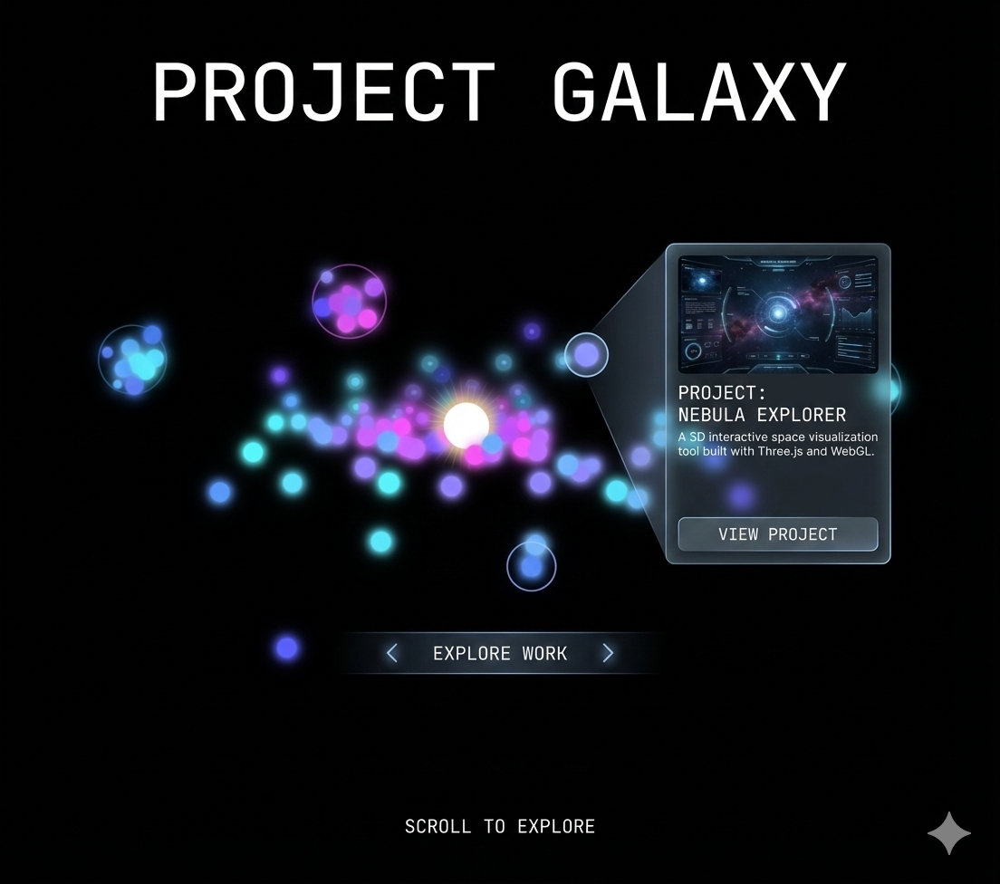

# Stage 2 - Project Galaxy 實作文件

## 設計概述

Stage 2 展示「Project Galaxy」- 一個以太空星球為主題的專案展示頁面。每個專案以星球形式呈現，用戶可以點擊星球查看專案詳情。



---

## 視覺分析

### 標題區
- 文字：`PROJECT GALAXY`
- 樣式：大字、置中、白色、斜體、字距加寬
- 位置：頂部

### 背景層
- 使用現有的 Stage 2 粒子動畫（Planetary 效果）
- 彩色發光粒子散布在畫面中央

### 前景層 - 專案星球（分頁輪播）

**每頁顯示 3 個星球，可左右切換瀏覽更多專案**

```
星球分佈示意（每頁 3 個）：
    ┌────────────────────────────────────┐
    │           PROJECT GALAXY           │
    │                                    │
    │                                    │
    │    🪐         🌍         🌑        │  ← 3 個星球
    │   (lg)       (xl)       (md)       │
    │                                    │
    │                    ┌─────────────┐ │
    │                    │ Project Card│ │  ← 點擊顯示
    │                    └─────────────┘ │
    │                                    │
    │    ◀   ● ○ ○ ○   EXPLORE WORK   ▶ │  ← 分頁指示 + 導航
    │                                    │
    │        SCROLL TO EXPLORE          │
    └────────────────────────────────────┘
```

**分頁邏輯：**
- 每頁顯示 3 個星球
- 左右箭頭切換頁面
- 底部顯示分頁指示點
- 切換時星球有淡入淡出動畫
- 支援鍵盤左右鍵導航

**星球特點：**
- 不同大小（60px - 120px）
- 圓形，帶光暈效果
- 使用專案截圖作為星球表面紋理
- 懸浮動畫（上下微動）
- Hover 時放大 + 發光增強
- 固定三個位置：左、中、右（大小不同增加層次感）

### 專案卡片（Hover/Click 顯示）

```
┌─────────────────────────────────────┐
│  ┌─────────────────────────────┐   │
│  │                             │   │
│  │      [Project Screenshot]   │   │
│  │                             │   │
│  └─────────────────────────────┘   │
│                                     │
│  PROJECT:                           │
│  NEBULA EXPLORER                    │
│                                     │
│  A 3D interactive space             │
│  visualization tool built with      │
│  Three.js and WebGL.                │
│                                     │
│  ┌─────────────────────────────┐   │
│  │       VIEW PROJECT          │   │
│  └─────────────────────────────┘   │
└─────────────────────────────────────┘
```

**卡片樣式：**
- 科幻風格邊框（類似 SkillDashboard）
- 玻璃背景 + 模糊效果
- 角落裝飾
- 專案縮圖
- 專案名稱 + 描述
- CTA 按鈕

### 導航區
- `< EXPLORE WORK >` - 左右箭頭切換專案
- 或可使用水平滾動/拖曳

---

## 組件架構

```
src/components/stage2/
├── Stage2Overlay.tsx      # Stage 2 主覆蓋層
├── ProjectGalaxy.tsx      # 專案星系容器
├── ProjectPlanet.tsx      # 單個專案星球
├── ProjectCard.tsx        # 專案詳情卡片
├── GalaxyNav.tsx          # 導航控制
├── types.ts               # 類型定義
└── data.ts                # 專案資料
```

---

## 資料結構

### Project 資料

```typescript
interface Project {
  id: string
  name: string
  description: string
  thumbnail: string      // 圖片 URL (使用 picsum.photos)
  tags: string[]         // 技術標籤
  link?: string          // 專案連結
  github?: string        // GitHub 連結
  glowColor: string      // 星球光暈顏色
}

// 分頁配置
interface GalaxyConfig {
  planetsPerPage: number  // 每頁星球數量 (3)
  positions: PlanetPosition[]  // 固定的三個位置
}

// 星球固定位置（左、中、右）
interface PlanetPosition {
  x: number              // 相對位置 (0-100%)
  y: number
  size: 'md' | 'lg' | 'xl'
}
```

### 範例資料

```typescript
// 專案列表（可以有很多）
const projects: Project[] = [
  {
    id: 'nebula-explorer',
    name: 'Nebula Explorer',
    description: 'A 3D interactive space visualization tool built with Three.js and WebGL.',
    thumbnail: 'https://picsum.photos/seed/nebula/400/300',
    tags: ['Three.js', 'WebGL', 'React'],
    link: 'https://example.com/nebula',
    glowColor: 'cyan'
  },
  {
    id: 'data-forge',
    name: 'Data Forge',
    description: 'Real-time data analytics dashboard with advanced visualization.',
    thumbnail: 'https://picsum.photos/seed/dataforge/400/300',
    tags: ['D3.js', 'Node.js', 'PostgreSQL'],
    link: 'https://example.com/dataforge',
    glowColor: 'purple'
  },
  {
    id: 'code-stream',
    name: 'Code Stream',
    description: 'Live code collaboration platform with real-time sync.',
    thumbnail: 'https://picsum.photos/seed/codestream/400/300',
    tags: ['Socket.io', 'Monaco Editor', 'Redis'],
    glowColor: 'blue'
  },
  {
    id: 'ai-assistant',
    name: 'AI Assistant',
    description: 'Intelligent chatbot powered by machine learning.',
    thumbnail: 'https://picsum.photos/seed/aibot/400/300',
    tags: ['Python', 'TensorFlow', 'FastAPI'],
    glowColor: 'pink'
  },
  {
    id: 'cloud-sync',
    name: 'Cloud Sync',
    description: 'Cross-platform file synchronization service.',
    thumbnail: 'https://picsum.photos/seed/cloudsync/400/300',
    tags: ['AWS', 'Go', 'React Native'],
    glowColor: 'green'
  },
  {
    id: 'design-system',
    name: 'Design System',
    description: 'Comprehensive UI component library for enterprise apps.',
    thumbnail: 'https://picsum.photos/seed/designsys/400/300',
    tags: ['Storybook', 'Figma', 'TypeScript'],
    glowColor: 'orange'
  },
  // ... 可以繼續添加更多專案
]

// 固定的三個星球位置（每頁）
const planetPositions: PlanetPosition[] = [
  { x: 20, y: 40, size: 'lg' },   // 左側
  { x: 50, y: 30, size: 'xl' },   // 中間（最大）
  { x: 80, y: 45, size: 'md' },   // 右側
]

// 分頁計算
const PLANETS_PER_PAGE = 3
const totalPages = Math.ceil(projects.length / PLANETS_PER_PAGE)
// 第 N 頁的專案：projects.slice(page * 3, page * 3 + 3)
```

---

## 組件規格

### 1. Stage2Overlay

**責任：**
- Stage 2 的主容器
- 管理進場/退場動畫
- 根據 scrollProgress 控制透明度

**Props:**
```typescript
interface Stage2OverlayProps {
  scrollProgress: number  // 0-3
}
```

**可見性計算：**
```typescript
const STAGE2_VISIBILITY = {
  fadeInStart: 1.5,
  fadeInEnd: 2.0,
  fadeOutStart: 2.5,
  fadeOutEnd: 3.0,
}
```

### 2. ProjectGalaxy

**責任：**
- 管理分頁狀態
- 顯示當前頁的 3 個星球
- 處理選中狀態
- 頁面切換動畫

**Props:**
```typescript
interface ProjectGalaxyProps {
  projects: Project[]
  positions: PlanetPosition[]
}
```

**State:**
```typescript
const [currentPage, setCurrentPage] = useState(0)
const [selectedId, setSelectedId] = useState<string | null>(null)
const [isTransitioning, setIsTransitioning] = useState(false)

// 計算當前頁的專案
const currentProjects = useMemo(() => {
  const start = currentPage * PLANETS_PER_PAGE
  return projects.slice(start, start + PLANETS_PER_PAGE)
}, [currentPage, projects])

const totalPages = Math.ceil(projects.length / PLANETS_PER_PAGE)
const canGoPrev = currentPage > 0
const canGoNext = currentPage < totalPages - 1
```

**頁面切換：**
```typescript
const goToPage = (page: number) => {
  if (isTransitioning) return
  setIsTransitioning(true)
  setSelectedId(null)  // 關閉卡片

  // 星球淡出
  gsap.to('.planet', {
    opacity: 0,
    scale: 0.5,
    duration: 0.3,
    onComplete: () => {
      setCurrentPage(page)
      // 新星球淡入
      gsap.fromTo('.planet',
        { opacity: 0, scale: 0.5 },
        {
          opacity: 1,
          scale: 1,
          duration: 0.5,
          stagger: 0.1,
          ease: 'back.out',
          onComplete: () => setIsTransitioning(false)
        }
      )
    }
  })
}
```

### 3. ProjectPlanet

**責任：**
- 渲染單個專案星球
- 懸浮動畫
- Hover/Click 互動

**Props:**
```typescript
interface ProjectPlanetProps {
  project: Project
  config: PlanetConfig
  isSelected: boolean
  onClick: () => void
}
```

**尺寸映射：**
```typescript
const sizeMap = {
  sm: 50,
  md: 70,
  lg: 90,
  xl: 120,
}
```

**樣式：**
```css
/* 星球基礎樣式 */
.planet {
  border-radius: 50%;
  background-size: cover;
  background-position: center;
  box-shadow:
    0 0 20px var(--glow-color),
    inset 0 0 20px rgba(0,0,0,0.5);
  transition: transform 0.3s, box-shadow 0.3s;
}

/* Hover 效果 */
.planet:hover {
  transform: scale(1.1);
  box-shadow:
    0 0 40px var(--glow-color),
    0 0 60px var(--glow-color);
}

/* 懸浮動畫 */
@keyframes float {
  0%, 100% { transform: translateY(0); }
  50% { transform: translateY(-10px); }
}
```

### 4. ProjectCard

**責任：**
- 顯示專案詳情
- 定位在選中星球旁邊

**Props:**
```typescript
interface ProjectCardProps {
  project: Project
  position: { x: number; y: number }
  onClose: () => void
}
```

**卡片佈局：**
```typescript
// 根據星球位置決定卡片顯示方向
const cardPosition = useMemo(() => {
  // 如果星球在右半邊，卡片顯示在左邊
  // 如果星球在左半邊，卡片顯示在右邊
  const showOnLeft = position.x > 50
  return {
    left: showOnLeft ? 'auto' : `${position.x + 10}%`,
    right: showOnLeft ? `${100 - position.x + 10}%` : 'auto',
    top: `${position.y}%`,
  }
}, [position])
```

### 5. GalaxyNav

**責任：**
- 專案導航控制
- 左右切換

**Props:**
```typescript
interface GalaxyNavProps {
  currentIndex: number
  totalCount: number
  onPrev: () => void
  onNext: () => void
}
```

---

## 動畫規格

### 星球懸浮動畫

```typescript
// 每個星球有不同的動畫延遲和週期
const floatAnimation = (index: number) => ({
  y: [0, -10, 0],
  transition: {
    duration: 3 + (index % 3) * 0.5,  // 3-4.5秒
    repeat: Infinity,
    ease: 'easeInOut',
    delay: index * 0.2,
  }
})
```

### 星球進場動畫

```typescript
// 星球從遠處飛入
gsap.fromTo(planets,
  { scale: 0, opacity: 0 },
  {
    scale: 1,
    opacity: 1,
    duration: 0.8,
    stagger: 0.1,
    ease: 'back.out(1.7)',
    delay: 0.3
  }
)
```

### 專案卡片動畫

```typescript
// 卡片展開動畫
gsap.fromTo(cardRef,
  { scale: 0.8, opacity: 0, y: 20 },
  {
    scale: 1,
    opacity: 1,
    y: 0,
    duration: 0.4,
    ease: 'power2.out'
  }
)
```

### 選中星球效果

```typescript
// 選中時的脈動效果
gsap.to(selectedPlanet, {
  boxShadow: `0 0 60px ${glowColor}`,
  scale: 1.15,
  duration: 0.3
})
```

---

## 響應式設計

### 桌面版 (md+)
- 星球散布在畫面各處
- 卡片顯示在星球旁邊
- 完整的懸浮動畫

### 手機版 (< md)
- 星球排列成橫向滾動列表
- 或使用輪播方式展示
- 卡片顯示在下方（類似 Stage 1 的玻璃卡片）
- 簡化動畫效果

**手機版佈局方案：**
```
┌─────────────────────────┐
│     PROJECT GALAXY      │
│                         │
│   [粒子動畫背景]         │
│                         │
│  🪐  🌍  🌑  🔵  ⭐    │ ← 水平滾動
│                         │
│ ┌─────────────────────┐ │
│ │   [Project Card]    │ │ ← 玻璃卡片
│ │   展示選中專案       │ │
│ └─────────────────────┘ │
│                         │
│    SCROLL TO EXPLORE    │
└─────────────────────────┘
```

---

## 圖片處理

### Picsum Photos 使用

```typescript
// 生成隨機但固定的圖片
const getProjectImage = (seed: string, width = 400, height = 300) => {
  return `https://picsum.photos/seed/${seed}/${width}/${height}`
}

// 範例
const thumbnail = getProjectImage('nebula', 400, 300)
// => https://picsum.photos/seed/nebula/400/300
```

### 星球紋理效果

```css
.planet-texture {
  background-image: url('...');
  background-size: cover;
  border-radius: 50%;

  /* 添加球體感 */
  background-blend-mode: overlay;
  box-shadow:
    inset -20px -20px 40px rgba(0,0,0,0.6),
    inset 10px 10px 20px rgba(255,255,255,0.1);
}
```

---

## 實作步驟

### Phase 1: 基礎組件
1. 建立 `src/components/stage2/` 資料夾
2. 建立 types.ts 和 data.ts
3. 實作 ProjectPlanet 組件
4. 實作 ProjectCard 組件

### Phase 2: 整合
5. 實作 ProjectGalaxy 容器
6. 實作 GalaxyNav 導航
7. 實作 Stage2Overlay 主組件
8. 整合到 ParticleCanvas

### Phase 3: 動畫與互動
9. 添加星球懸浮動畫
10. 添加進場/退場動畫
11. 實作選中/Hover 效果

### Phase 4: 響應式
12. 手機版佈局
13. 觸控手勢支援
14. 效能優化

---

## 測試清單

- [ ] 星球正確顯示並有懸浮動畫
- [ ] 點擊星球顯示專案卡片
- [ ] 卡片位置正確（不超出畫面）
- [ ] 卡片內容正確顯示
- [ ] "VIEW PROJECT" 連結正常
- [ ] 導航切換正常
- [ ] Stage 1 → 2 過渡動畫流暢
- [ ] Stage 2 → 3 過渡動畫流暢
- [ ] 手機版佈局正確
- [ ] 圖片載入正常（picsum.photos）

---

## 技術備註

### 效能優化
- 圖片使用 lazy loading
- 離開視野的星球暫停動畫
- 使用 `will-change: transform` 優化動畫

### 無障礙
- 星球可用鍵盤 Tab 聚焦
- 卡片有適當的 ARIA 標籤
- 確保足夠的顏色對比度

### 注意事項
- picsum.photos 圖片可能載入較慢，需要 loading 狀態
- 星球位置需要避免重疊
- 卡片需要智能定位避免超出畫面邊界
