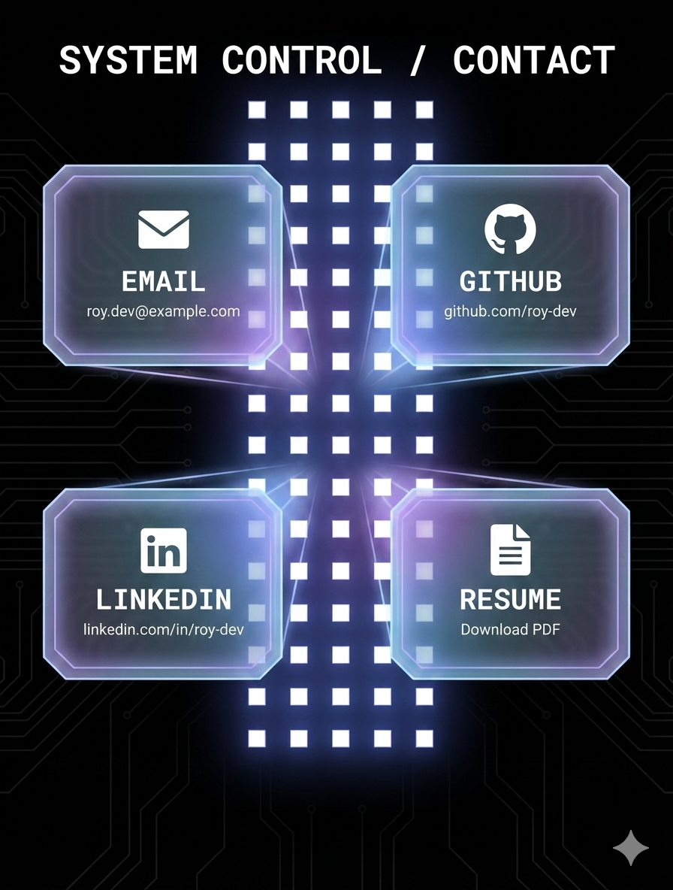

# Stage 4 - System Control / Contact 實作文件

## 設計概述

Stage 4 展示「System Control / Contact」- 一個科幻風格的聯絡資訊頁面。以控制面板為主題，呈現各種聯絡方式與社交連結。



---

## 視覺分析

### 標題區
- 文字：`SYSTEM CONTROL / CONTACT`
- 樣式：大字、置中、白色、字距加寬、科幻字體
- 位置：頂部

### 背景層
- 深色背景（#000 或深藍黑色）
- 微弱的電路板紋理/線條
- 使用現有粒子動畫（Grid 效果過渡）

### 中央脊柱（Central Spine）
- 垂直排列的發光點陣
- 位於畫面正中央
- 藍色/青色漸層發光效果
- 類似電路板的連接感

### 聯絡卡片（2x2 Grid）

```
┌────────────────────────────────────────┐
│       SYSTEM CONTROL / CONTACT         │
│                                        │
│   ┌──────────┐    ┌──────────┐        │
│   │  ✉️      │ ●● │  🐙      │        │
│   │  EMAIL   │ ●● │  GITHUB  │        │
│   │  @email  │ ●● │  /user   │        │
│   └──────────┘ ●● └──────────┘        │
│                ●●                      │
│   ┌──────────┐ ●● ┌──────────┐        │
│   │  💼      │ ●● │  📄      │        │
│   │ LINKEDIN │ ●● │  RESUME  │        │
│   │  /in/... │ ●● │  PDF     │        │
│   └──────────┘    └──────────┘        │
│                                        │
│          ◆ (底部裝飾)                   │
└────────────────────────────────────────┘
```

**卡片特點：**
- 玻璃形態（Glass Morphism）
- 藍色/青色邊框發光
- 角落裝飾（sci-fi corner accents）
- 內部有圖標 + 標題 + 副標題
- Hover 時發光增強 + 輕微放大

---

## 卡片設計細節

### 單一卡片結構

```
┌─────────────────────────────┐
│  ┌─┐                    ┌─┐ │  ← 角落裝飾
│                             │
│         [ICON]              │  ← 圖標（32-48px）
│                             │
│         TITLE               │  ← 標題（粗體、白色）
│      subtitle/link          │  ← 副標題（淺色、小字）
│                             │
│  └─┘                    └─┘ │  ← 角落裝飾
└─────────────────────────────┘
```

### 卡片樣式

```css
/* 卡片容器 */
.contact-card {
  background: rgba(0, 20, 40, 0.6);
  backdrop-filter: blur(16px);
  border: 1px solid rgba(0, 200, 255, 0.3);
  border-radius: 12px;
  padding: 24px;

  /* 發光效果 */
  box-shadow:
    0 0 20px rgba(0, 200, 255, 0.1),
    inset 0 0 20px rgba(0, 200, 255, 0.05);
}

/* Hover 狀態 */
.contact-card:hover {
  border-color: rgba(0, 200, 255, 0.6);
  box-shadow:
    0 0 40px rgba(0, 200, 255, 0.3),
    inset 0 0 30px rgba(0, 200, 255, 0.1);
  transform: scale(1.02);
}

/* 角落裝飾 */
.corner-accent {
  position: absolute;
  width: 12px;
  height: 12px;
  border-color: #00c8ff;
}
.corner-tl { border-top: 2px solid; border-left: 2px solid; top: -1px; left: -1px; }
.corner-tr { border-top: 2px solid; border-right: 2px solid; top: -1px; right: -1px; }
.corner-bl { border-bottom: 2px solid; border-left: 2px solid; bottom: -1px; left: -1px; }
.corner-br { border-bottom: 2px solid; border-right: 2px solid; bottom: -1px; right: -1px; }
```

---

## 聯絡資訊項目

### 資料結構

```typescript
interface ContactItem {
  id: string
  type: 'email' | 'github' | 'linkedin' | 'resume' | 'twitter' | 'website'
  icon: React.ComponentType  // SVG 圖標組件
  title: string              // 顯示標題
  subtitle: string           // 副標題/連結文字
  href: string               // 連結 URL
  action?: 'link' | 'copy' | 'download'  // 點擊行為
}
```

### 預設資料

```typescript
const contactItems: ContactItem[] = [
  {
    id: 'email',
    type: 'email',
    icon: EmailIcon,
    title: 'EMAIL',
    subtitle: 'your.email@example.com',
    href: 'mailto:your.email@example.com',
    action: 'copy',  // 點擊複製，長按開啟郵件
  },
  {
    id: 'github',
    type: 'github',
    icon: GitHubIcon,
    title: 'GITHUB',
    subtitle: 'github.com/username',
    href: 'https://github.com/username',
    action: 'link',
  },
  {
    id: 'linkedin',
    type: 'linkedin',
    icon: LinkedInIcon,
    title: 'LINKEDIN',
    subtitle: 'linkedin.com/in/username',
    href: 'https://linkedin.com/in/username',
    action: 'link',
  },
  {
    id: 'resume',
    type: 'resume',
    icon: ResumeIcon,
    title: 'RESUME',
    subtitle: 'Download PDF',
    href: '/resume.pdf',
    action: 'download',
  },
]
```

---

## 組件架構

```
src/components/stage4/
├── Stage4Overlay.tsx      # Stage 4 主覆蓋層
├── ContactPanel.tsx       # 聯絡面板容器
├── ContactCard.tsx        # 單一聯絡卡片
├── CentralSpine.tsx       # 中央發光脊柱
├── icons.tsx              # SVG 圖標組件
├── types.ts               # 類型定義
└── data.ts                # 聯絡資料配置
```

---

## 組件規格

### 1. Stage4Overlay

**責任：**
- Stage 4 的主容器
- 管理進場/退場動畫
- 根據 scrollProgress 控制透明度

**Props:**
```typescript
interface Stage4OverlayProps {
  scrollProgress: number  // 0-4
}
```

**可見性計算：**
```typescript
const STAGE4_VISIBILITY = {
  fadeInStart: 2.5,   // 開始淡入
  fadeInEnd: 3.0,     // 完全可見
  fadeOutStart: 3.5,  // 開始淡出
  fadeOutEnd: 4.0,    // 完全消失
}

const calculateOpacity = (progress: number) => {
  if (progress < fadeInStart) return 0
  if (progress < fadeInEnd) {
    return (progress - fadeInStart) / (fadeInEnd - fadeInStart)
  }
  if (progress < fadeOutStart) return 1
  if (progress < fadeOutEnd) {
    return 1 - (progress - fadeOutStart) / (fadeOutEnd - fadeOutStart)
  }
  return 0
}
```

### 2. ContactPanel

**責任：**
- 排列聯絡卡片（2x2 Grid）
- 管理卡片進場動畫順序
- 響應式佈局切換

**Props:**
```typescript
interface ContactPanelProps {
  items: ContactItem[]
  animate?: boolean
}
```

**佈局：**
```typescript
// 桌面版：2x2 Grid，中間有 Spine
// 手機版：單列垂直排列

<div className="grid grid-cols-1 md:grid-cols-[1fr_auto_1fr] gap-6">
  {/* 左欄 */}
  <div className="space-y-6">
    <ContactCard item={items[0]} />
    <ContactCard item={items[2]} />
  </div>

  {/* 中央脊柱 - 僅桌面版 */}
  <CentralSpine className="hidden md:block" />

  {/* 右欄 */}
  <div className="space-y-6">
    <ContactCard item={items[1]} />
    <ContactCard item={items[3]} />
  </div>
</div>
```

### 3. ContactCard

**責任：**
- 渲染單一聯絡卡片
- 處理點擊事件（連結/複製/下載）
- Hover 動畫效果

**Props:**
```typescript
interface ContactCardProps {
  item: ContactItem
  delay?: number  // 進場動畫延遲
}
```

**點擊行為：**
```typescript
const handleClick = () => {
  switch (item.action) {
    case 'copy':
      navigator.clipboard.writeText(item.subtitle)
      // 顯示 "Copied!" 提示
      break
    case 'download':
      // 觸發下載
      window.open(item.href, '_blank')
      break
    case 'link':
    default:
      window.open(item.href, '_blank')
  }
}
```

### 4. CentralSpine

**責任：**
- 渲染中央發光點陣
- 脈動動畫效果

**動畫：**
```typescript
// 點陣脈動效果
const dots = Array.from({ length: 20 }, (_, i) => ({
  y: i * 20,
  delay: i * 0.05,
}))

// GSAP 動畫
gsap.to('.spine-dot', {
  opacity: [0.3, 1, 0.3],
  scale: [0.8, 1.2, 0.8],
  duration: 2,
  stagger: 0.1,
  repeat: -1,
  ease: 'sine.inOut',
})
```

---

## 圖標設計

### SVG 圖標規格

```typescript
// 統一尺寸和樣式
interface IconProps {
  size?: number      // 預設 32
  color?: string     // 預設 'currentColor'
  className?: string
}

// Email 圖標
const EmailIcon = ({ size = 32, color = 'currentColor' }: IconProps) => (
  <svg width={size} height={size} viewBox="0 0 24 24" fill="none">
    <rect x="2" y="4" width="20" height="16" rx="2" stroke={color} strokeWidth="2"/>
    <path d="M2 6l10 7 10-7" stroke={color} strokeWidth="2" strokeLinecap="round"/>
  </svg>
)

// GitHub 圖標（使用官方 logo）
// LinkedIn 圖標
// Resume/Document 圖標
```

---

## 動畫規格

### 卡片進場動畫

```typescript
// 卡片依序淡入
useGSAP(() => {
  gsap.fromTo(
    cardRef.current,
    { opacity: 0, y: 30, scale: 0.9 },
    {
      opacity: 1,
      y: 0,
      scale: 1,
      duration: 0.6,
      delay: delay,
      ease: 'power2.out',
    }
  )
}, [])

// 進場順序：左上 → 右上 → 左下 → 右下
const delays = [0, 0.15, 0.3, 0.45]
```

### Hover 效果

```typescript
// 卡片 Hover 動畫
const handleMouseEnter = () => {
  gsap.to(cardRef.current, {
    scale: 1.03,
    boxShadow: '0 0 40px rgba(0, 200, 255, 0.4)',
    duration: 0.3,
    ease: 'power2.out',
  })

  // 圖標發光
  gsap.to(iconRef.current, {
    filter: 'drop-shadow(0 0 10px rgba(0, 200, 255, 0.8))',
    duration: 0.3,
  })
}
```

### 脊柱脈動

```typescript
// 中央脊柱的光點脈動
gsap.to('.spine-dot', {
  keyframes: [
    { opacity: 0.3, scale: 0.8 },
    { opacity: 1, scale: 1.2 },
    { opacity: 0.3, scale: 0.8 },
  ],
  duration: 2,
  stagger: {
    each: 0.08,
    from: 'center',  // 從中間向兩端擴散
  },
  repeat: -1,
  ease: 'sine.inOut',
})
```

---

## 響應式設計

### 桌面版 (md+)
```
┌──────────────────────────────────────┐
│      SYSTEM CONTROL / CONTACT        │
│                                      │
│  ┌────────┐    ●●    ┌────────┐     │
│  │ EMAIL  │    ●●    │ GITHUB │     │
│  └────────┘    ●●    └────────┘     │
│                ●●                    │
│  ┌────────┐    ●●    ┌────────┐     │
│  │LINKEDIN│    ●●    │ RESUME │     │
│  └────────┘    ●●    └────────┘     │
│                                      │
└──────────────────────────────────────┘
```

### 手機版 (< md)
```
┌─────────────────────┐
│  SYSTEM CONTROL /   │
│      CONTACT        │
│                     │
│   ┌─────────────┐   │
│   │    EMAIL    │   │
│   └─────────────┘   │
│                     │
│   ┌─────────────┐   │
│   │   GITHUB    │   │
│   └─────────────┘   │
│                     │
│   ┌─────────────┐   │
│   │  LINKEDIN   │   │
│   └─────────────┘   │
│                     │
│   ┌─────────────┐   │
│   │   RESUME    │   │
│   └─────────────┘   │
│                     │
└─────────────────────┘
```

**手機版調整：**
- 隱藏中央脊柱
- 卡片全寬單列排列
- 減少動畫複雜度
- 卡片間距縮小

---

## 實作步驟

### Phase 1: 基礎組件
1. 建立 `src/components/stage4/` 資料夾
2. 建立 types.ts 和 data.ts
3. 建立 icons.tsx（SVG 圖標）
4. 實作 ContactCard 組件

### Phase 2: 整合
5. 實作 CentralSpine 組件
6. 實作 ContactPanel 容器
7. 實作 Stage4Overlay 主組件
8. 整合到 ParticleCanvas

### Phase 3: 動畫與互動
9. 添加卡片進場動畫
10. 添加 Hover 效果
11. 添加脊柱脈動動畫
12. 實作點擊複製功能

### Phase 4: 響應式與完善
13. 手機版佈局
14. 複製成功提示 Toast
15. 效能優化

---

## 測試清單

- [ ] 卡片正確顯示所有聯絡資訊
- [ ] 點擊 Email 可複製地址
- [ ] 點擊 GitHub/LinkedIn 開啟新視窗
- [ ] 點擊 Resume 觸發下載
- [ ] Hover 動畫流暢
- [ ] 中央脊柱動畫正常
- [ ] Stage 3 → 4 過渡流暢
- [ ] 手機版佈局正確
- [ ] 複製提示正常顯示

---

## 技術備註

### Email 複製功能
```typescript
const copyToClipboard = async (text: string) => {
  try {
    await navigator.clipboard.writeText(text)
    // 顯示成功提示
    showToast('Copied to clipboard!')
  } catch {
    // Fallback for older browsers
    const textArea = document.createElement('textarea')
    textArea.value = text
    document.body.appendChild(textArea)
    textArea.select()
    document.execCommand('copy')
    document.body.removeChild(textArea)
  }
}
```

### 下載處理
```typescript
const handleDownload = (url: string, filename: string) => {
  const link = document.createElement('a')
  link.href = url
  link.download = filename
  link.click()
}
```

### 無障礙考量
- 所有卡片可用 Tab 鍵聚焦
- 正確的 `aria-label` 標籤
- 複製成功有視覺和螢幕閱讀器提示
- 足夠的顏色對比度

---

## 顏色配置

```typescript
const CONTACT_COLORS = {
  // 主要顏色
  primary: '#00c8ff',      // 青色
  primaryDark: '#0099cc',
  primaryGlow: 'rgba(0, 200, 255, 0.4)',

  // 卡片背景
  cardBg: 'rgba(0, 20, 40, 0.6)',
  cardBorder: 'rgba(0, 200, 255, 0.3)',
  cardBorderHover: 'rgba(0, 200, 255, 0.6)',

  // 文字
  title: '#ffffff',
  subtitle: 'rgba(255, 255, 255, 0.6)',

  // 脊柱
  spineDot: '#00c8ff',
  spineGlow: 'rgba(0, 200, 255, 0.6)',
}
```
